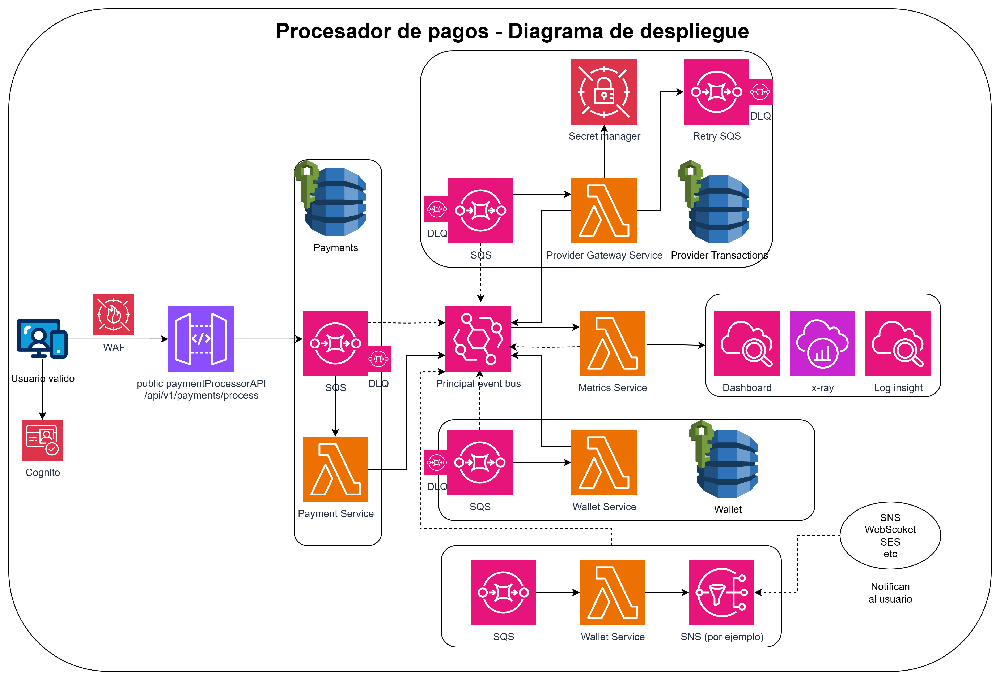

# Sistema de Pagos Orientado a Eventos (PoC en Go)
Este repositorio contiene una implementación de prueba de concepto (Proof of Concept) para un sistema de procesamiento de pagos, basado en una arquitectura de microservicios orientada a eventos y diseñada para ejecutarse en un entorno serverless (AWS Lambda).

El objetivo de este proyecto es demostrar la aplicación de principios de diseño de software robustos como la Arquitectura Hexagonal, el Patrón Saga para transacciones distribuidas y el manejo integral de errores en un sistema asíncrono. 

<b> Esto no es una implementación real, si no una demostración de implementación aplicando buenas prácticas. El código no solo esta incompleto, si no que se puede mejorar en varios aspectos.</b>

## 1. Arquitectura del Sistema
La arquitectura general se basa en un conjunto de microservicios desacoplados que se comunican a través de un bus de eventos central. Cada servicio es dueño de su propio dominio y base de datos, garantizando una alta cohesión y bajo acoplamiento.

Para más detalles, consultar el documento de diseño de arquitectura completo. [Diseño completo](https://docs.google.com/document/d/1Q58RjFbj48WOTY-b6ZPQ5h_nuTJ1xJpIvmEAFc2aY98/edit?usp=sharing)

### Diagrama de Despliegue en AWS


### Flujos de Pago


## 2. Conceptos Clave
Arquitectura Orientada a Eventos (EDA): Los servicios reaccionan a eventos de negocio, lo que permite un desacoplamiento máximo y una alta escalabilidad.

Serverless: La implementación está pensada para AWS Lambda, eliminando la necesidad de gestionar servidores y permitiendo un escalado automático.

Arquitectura Hexagonal (Puertos y Adaptadores): La lógica de negocio (dominio) está completamente aislada de las tecnologías externas (frameworks, bases de datos, brokers de mensajes). La comunicación se realiza a través de puertos (interfaces) y adaptadores (implementaciones concretas), lo que facilita enormemente las pruebas y la mantenibilidad.

Patrón Saga (Coreografiada): Se utiliza para mantener la consistencia de los datos a través de múltiples servicios sin usar transacciones distribuidas. Si un paso falla, se ejecutan acciones de compensación.

## 3. Estructura del Proyecto (Monorepo)
El proyecto está organizado como un monorepo, donde cada servicio principal reside en su propio directorio.

# Estructura del Proyecto: `wallet-service-lambda`

```bash
wallet-service-lambda/
├── cmd/
│   └── main.go
└── bootstrap/

├── internal/
│   └── debit/                        # Lógica del caso de uso "debitar saldo"
│       ├── application/
│       │   ├── ports/                # Interfaces (puertos) para el mundo exterior
│       │   │   └── mocks/            # Mocks generados para los puertos
│       │   └── debit_balance.go      # El caso de uso principal
│       ├── domain/                   # Lógica y entidades de negocio puras
│       │   ├── wallet.go
│       │   ├── error.go
│       │   └── events/
│       └── infra/                    # Implementación de adaptadores
│           ├── bus/                  # Adaptador para el bus de eventos
│           ├── handler/              # Adaptador de entrada (ej. SQS)
│           │   └── mocks/
│           └── repository/           # Adaptador de persistencia (ej. DynamoDB)
└── go.mod
```

## Eventos de la Saga de Pago

| Nombre del Evento       | Servicio Publicador | Descripción                                                   |
|--------------------------|---------------------|---------------------------------------------------------------|
| **PaymentInit**          | Payment Service     | Inicia una nueva saga de pago.                               |
| **BalanceDebited**       | Wallet Service      | Notifica que el saldo ha sido debitado.                      |
| **InsufficientBalance**  | Wallet Service      | Notifica fallo por fondos insuficientes.                     |
| **ProviderPaymentSuccess** | Provider Gateway  | Confirma que la pasarela externa procesó el pago.            |
| **ProviderPaymentFailed**  | Provider Gateway  | Indica que la pasarela externa falló.                        |
| **ReembolsarUsuario**    | Payment Service     | Inicia la acción de compensación para devolver fondos.       |
| **PaymentCompleted**     | Payment Service     | Evento final que indica éxito en la saga.                    |
| **PaymentFailed**        | Payment Service     | Evento final que indica fallo en la saga.                    |

## 5. Cómo Ejecutar las Pruebas
Este proyecto no requiere despliegue en AWS para su validación. La lógica se verifica a través de una suite de tests unitarios y de integración local.

Instalar dependencias:

```go mod tidy```

Generar los mocks (requiere mockery):

```mockery --config .mockery.yaml```

Ejecutar todos los tests:
El siguiente comando correrá los tests para todas las capas, incluyendo el test end-to-end que valida la integración de todos los componentes locales.

```go test ./...```


## 6. Alcance de la Implementación
Esta es una prueba de concepto y no una implementación lista para producción.

Servicios Implementados: wallet-service-lambda.

Infraestructura: El bus de eventos y la base de datos están simulados en memoria (mocks) para centrarse en la lógica de negocio y facilitar las pruebas.

Observabilidad: Demostrada a través de logs estructurados y la instrumentación con OpenTelemetry en el código.
